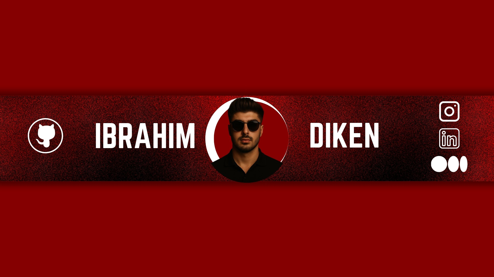

<!-- Banner -->

  

<h1 align="center" style="color: #00ffff;">👋 Merhaba, ben İbrahim Diken</h1>

  

---

## 💡 Hakkımda

Merhaba! Ben İbrahim Diken – yapay zeka tutkunu, yazılım geliştirici ve ibrilay.digital kurucusuyum.

- 🎓 Yönetim Bilişim Sistemleri öğrencisiyim  
- 🤖 AI & LLM projeleri geliştiriyorum (Ollama, Hugging Face, Python)  
- 💻 Tamamen açık kaynak odaklı, paylaşımcıyım  
- 📸 Aynı zamanda sosyal medyada yazılımı eğlenceli hale getiriyorum

---

## 🚀 Projelerim

- 🧠 **Silent Bitmoji** – İşitme ve konuşma engelliler için animasyonlu iletişim
- 📚 **LearnStep** – Soru sormaya teşvik eden adım adım öğrenme sistemi

---

## 🛠️ Kullandığım Teknolojiler

- Python • Flask • HTML/CSS  
- Hugging Face • Ollama • AI/LLM  
- VS Code • Git & GitHub  
- ChatGPT Prompt Engineering  

---

## 📫 Bana ulaşın

- 📬 **Mail:** devibrahim@gmail.com  
- 🌐 [LinkedIn](https://www.linkedin.com/in/ibrahim-diken/)
- ✍️ [Medium](https://medium.com/@devibrahimdiken)
- 📸 [Instagram](https://www.instagram.com/devibrahimdiken)

---

  

